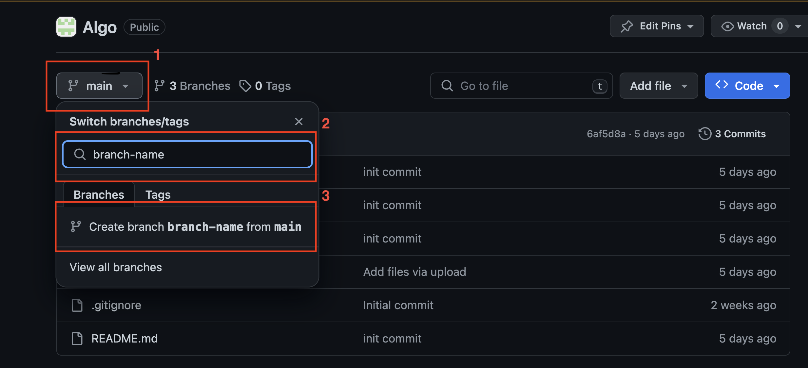
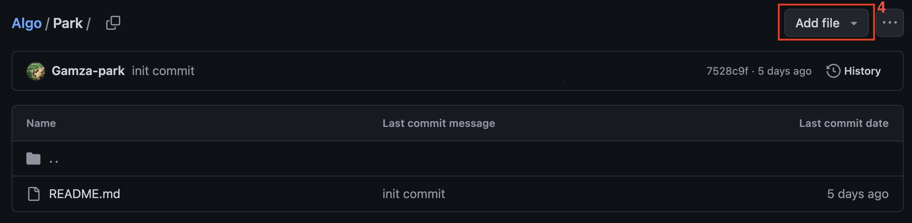
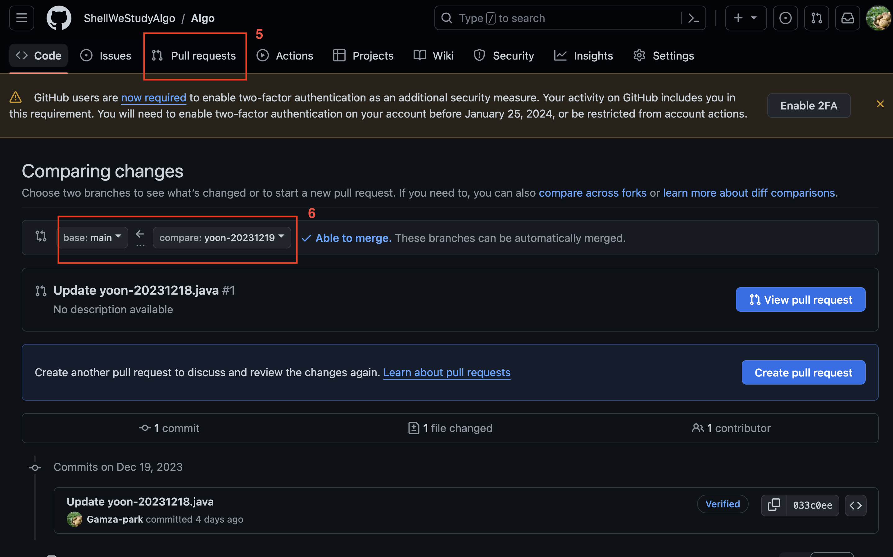

# Algo

## 스터디의 진행 시간
- 매주 화요일 21:00 ~ 진행

## 진행방식
- main브런치에서 해당 주의 브런치를 만들어 문제를 해결, 작성코드를 PR로 올리기!
- 브런치명은 {성}-{날짜} ex) park-20231212　로 만들어서 제출!


## 勉強会の進行時間
- 毎週火曜21:00 ~ 進行

## 進行方法
- メインブランチから週一回ブランチを切って問題を解決、作成コードをPRに上げる
- ブランチ名は{名字}-{日時} 例) park-20231212　で作成・提出

## Git
### Command
```
git checkout {branch-name} : branch-name의브런치로 이동
git checkout -b {branch-name} : branch-name의 브런치를 생성 후 이동
git status : 현재의 변경사항 확인
git add {file_name} : 변동사항을 리모트 저장소로 올리기위한 준비
git commit -m "{commit message}" : 변동사항에 커밋메세지를 남기며 저장
git push : 변동내용을 리모트 저장소로 전송
```

### Web

1. main브런치로부터 시작을 하며, main버튼을 클릭한다.
2. 생성하려는 브런치의 이름을 작성한다.
3. 3의 버튼을 클릭하여 새로운 브런치를 생성한다.

4. Add file버튼을 클릭하여, 작업내용의 파일은 추가해준다.

5. Pull Requests을 클릭 후, New pull request를 클릭한다.
6. 6의 main <- {새로추가한branch-name}이 되게 하여 create pull request를 작성한다.

